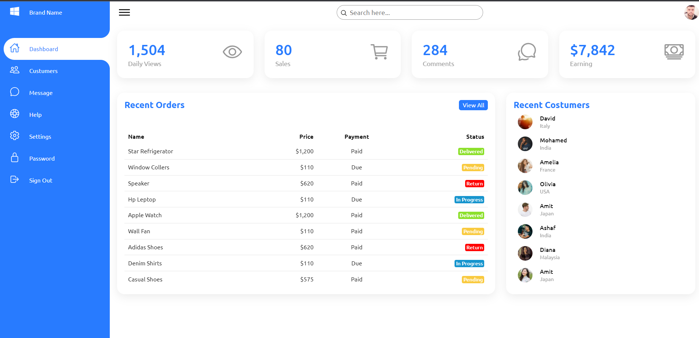
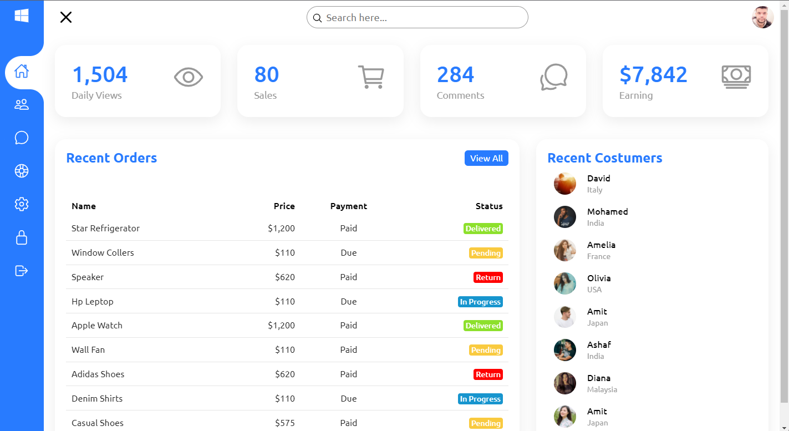

# 📈 Admin Dashboard

> ## Painel de administração responsivo usando HTML CSS e Javascript. 🔥

 
 

## 📷 Screenshot:

 
 

    

        
    

    

        
        
    

 
 

## Autor:

Henrique de Castro

## Licença:

Projeto está sob licença do [MIT](https://opensource.org/licenses/mit-license.php)
